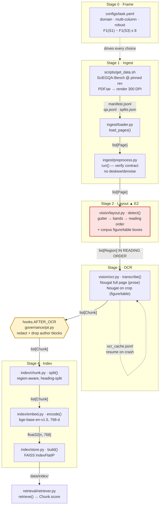

# Knowledge-base pipeline — PaperScholar (G19)

Stages 1–4, as built for A2. Stage order is fixed by `src/doc_agent/pipeline.py`; the
labels on the arrows are the `contracts.py` types that cross each boundary.



## Why the shape is what it is

**Stage 2 is the load-bearing stage, not Stage 3.** 56.1% of this corpus's questions have
their evidence annotated inside a figure or table, and 16.8% of pages are two-column
where reading order is not visual order. So `detect()` returns regions **in reading
order** and that list order is the contract Stage 3 consumes. Everything else follows
from getting that right.

**The two OCR paths exist for the two evidence kinds.** Page prose gets one full-page
Nougat pass, because Nougat resolves multi-column order internally and emits LaTeX for
mathematics. A figure or table gets its own pass over the padded crop, so evidence
living inside a region becomes its own retrievable, citable chunk rather than being
flattened into the surrounding prose.

**The PII seam sits between OCR and indexing** because that is the last point where text
exists but is not yet searchable — redacting later would leave identifiers in the index,
redacting earlier would mean re-reading pages.

**Chunks never span regions.** Fixed-size windows over a flattened page would re-mix the
columns Stage 2 just separated and glue table cells onto neighbouring prose. The region
boundary is what lets a retrieved chunk be traced back to one box on one page — which is
what A3's grounding gate will need.

## Data contracts crossing each boundary

| Boundary | Type | Carries |
|---|---|---|
| loader → preprocess → layout | `Page` | `id`, `image_path`, `doc_id` |
| layout → ocr | `list[Region]` | `page_id`, `bbox`, `kind`, **ordered** |
| ocr → pii → chunk → embed | `Chunk` | `id`, `doc_id`, `text`, `page_ids`, `score` |
| store → retriever | FAISS + `chunks.jsonl` | vectors + chunk payloads |

`contracts.py` is fixed and cannot gain fields, so per-page metadata (page number,
geometry, split, multi-column flag) lives in `ingest.loader.PAGE_META`, and per-region
reading-order index and provenance live in `vision.layout.REGION_META`, both keyed by id.

## Reproducing it

```bash
bash scripts/get_data.sh      # corpus @ pinned revision 9bdca77b
bash scripts/build_index.sh   # validate → stages 1-4 → data/index/
```

`build_index.sh` asserts the corpus floors (≥300 pages, ≥60k words) and that no document
appears in two splits before any model runs.
